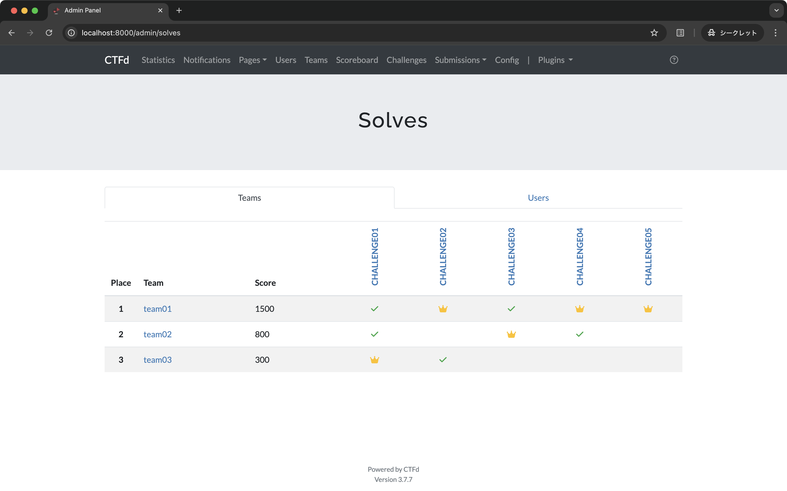

# CTFd Solves Plugin

A CTFd plugin to view who solved which challenges, including first bloods, at a glance.



## Installation

Follow these steps to install the plugin:

1. **Clone the repository into your CTFd plugins directory.**

   ```
   git clone https://github.com/chakumma/CTFd-solves-plugin.git /path/to/your/CTFd/plugins/solves/
   ```

2. **Restart your CTFd instance.**

## Usage

Once installed, navigate to the `/admin/solves` page on your CTFd instance.
